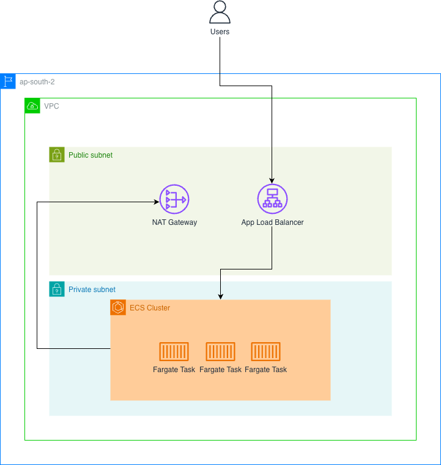

# CI/CD Pipeline for Cloud-Native Deployment to AWS ECS (Fargate)

This repository demonstrates a **production-grade CI/CD pipeline** that automatically deploys containerized applications to **AWS ECS Fargate** using **GitHub Actions**.

The focus of this project is **deployment automation**, with minimal manual interference.

---

## What This Project Does

On every push to the `main` branch:

1. GitHub Actions builds a Docker image
2. The image is pushed to Amazon ECR
3. A new ECS task definition revision is created
4. The ECS service is updated automatically
5. ECS performs a rolling deployment (no SSH, no manual steps)

---

## Key Design Principles

- **Immutable deployments** (image + task definition per commit)
- **No long-lived AWS credentials** (OIDC-based authentication)
- **Separation of concerns**
  - Infrastructure → Terraform (separate repo)
  - Delivery → GitHub Actions (this repo)
- **Zero manual deployment steps**

---

## Architecture Overview

This pipeline operates on top of an existing ECS Fargate infrastructure provisioned separately. Refer this [repo](https://github.com/ShaheelMhd/terraform-ecs-fargate) to know more about the infrastructure used in detail.

### High-Level Flow

GitHub Push → GitHub Actions → Docker Build → Amazon ECR → ECS Task Definition (New Revision) → ECS Service Rolling Deployment

---

## CI/CD Pipeline (`deploy.yml`)

The pipeline is implemented using **GitHub Actions** and performs the following steps:

1. Assumes an AWS IAM role using OIDC
2. Authenticates Docker with Amazon ECR
3. Builds a Docker image tagged with the commit SHA
4. Pushes the image to ECR
5. Injects the image URI into the ECS task definition template
6. Registers a new task definition revision
7. Updates the ECS service to trigger a rolling deployment

All steps are fully automated and auditable.

---

## ECS Task Definition (`task-def.json`)

The ECS task definition defines the runtime contract for the application, including:

- Fargate launch type
- CPU and memory requirements
- Container image (injected at deploy time)
- Port mappings
- CloudWatch logging configuration
- Execution role for pulling images and writing logs

Each deployment creates a new task definition revision, ensuring traceability and safe rollbacks.

---

## Security Model

- No AWS access keys stored in GitHub
- GitHub Actions authenticates using AWS OIDC
- Short-lived credentials with scoped IAM permissions
- All access is auditable via AWS CloudTrail
